# 3D Models — Home Repair & Household Prints

A collection of 3D models I designed myself in SketchUp to fix and improve things around the house. Each folder is one project; every version I iterated on is kept (`-v1`, `-v2`, …) — original SketchUp sources (`.skp`) plus print-ready STL exports.

All models were printed on an FDM printer and are in use at home.

## Projects

| Preview | Project | Original name | Versions | Size (latest) |
|---|---|---|---|---|
| 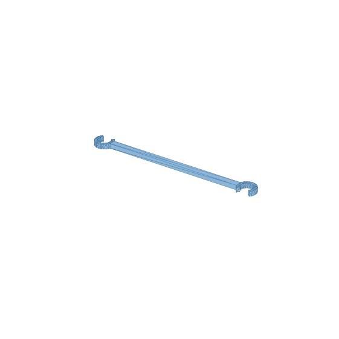 | **Flower holder** — wall/rail holder bracket for a flower pot | Держатель для цветка | v1–v3 | 224 × 24 × 8 mm |
| 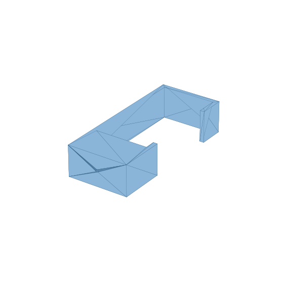 | **Lamp mount** — mounting bracket for a light fixture | Крепление светильника | v1–v2 | 30 × 70 × 20 mm |
| 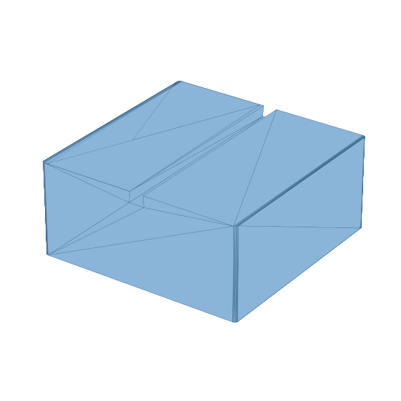 | **Shower hook mount** — wall mount for a shower hook | Крепление крючка на душ | v1 | 70 × 70 × 42 mm |
| 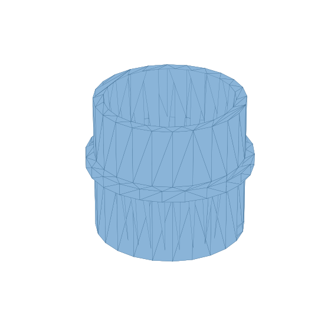 | **Spout adapter** — cylindrical adapter sleeve for a spout / shower head | Переходник на лейку | v1–v2 | ⌀29 × 36 mm |
| 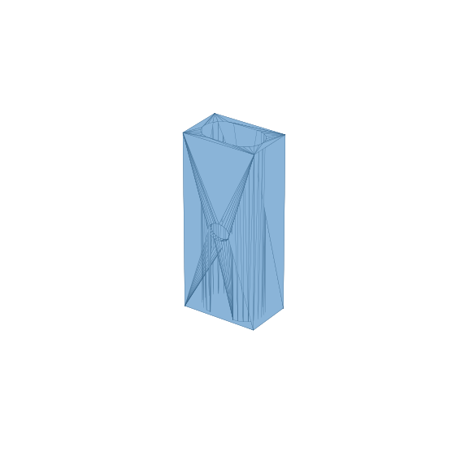 | **Umbrella repair** — replacement rib part for an umbrella | Ремонт зонтика | v1–v3 (v1 is .skp only) | 23 × 14 × 70 mm |
| 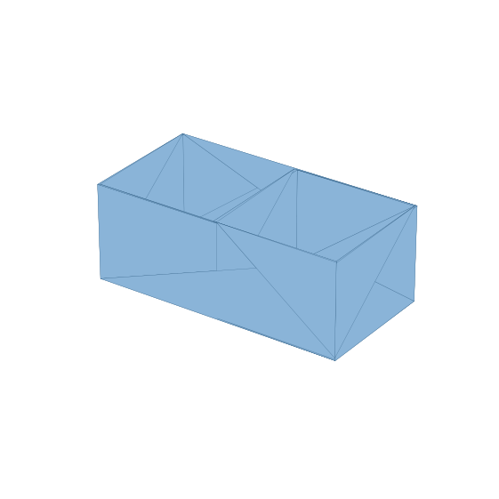 | **Bag dispenser box** — wall box + lid for storing plastic bags | Ящик для пакетов + Крышка | v1 (box + lid) | 160 × 80 × 80 mm |
| 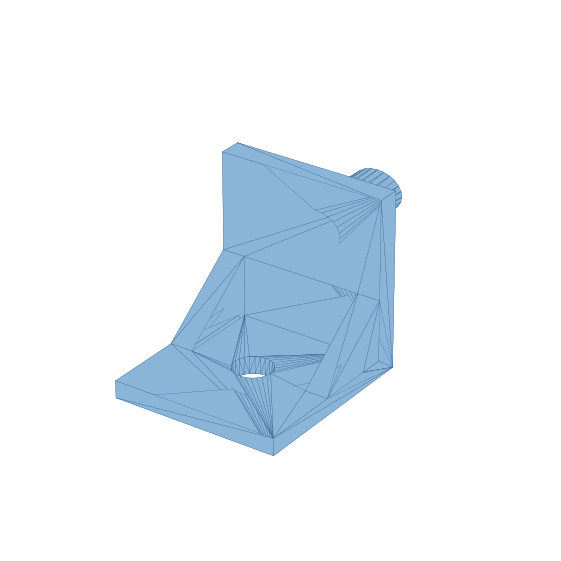 | **Roller-blind remote holder** — wall holder for a roller shutter remote | Держатель для управления ролетом | v1 | 22 × 37 × 31 mm |
| 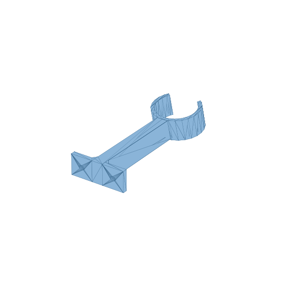 | **Vacuum tube holder** — wall mount for a Xiaomi vacuum tube (4 design steps + final) | Держатель трубы пылесоса Xiaomi | step1–4, final | 50 × 131 × 34 mm |
| 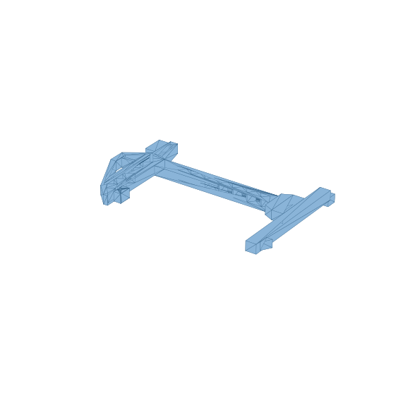 | **Desk crane** — decorative desk crane with a hanging pendant (flat print) | Кран стол | crane v1–v2, pendant v1–v2 + PSD sketch | 94 × 56 × 6 mm |
| 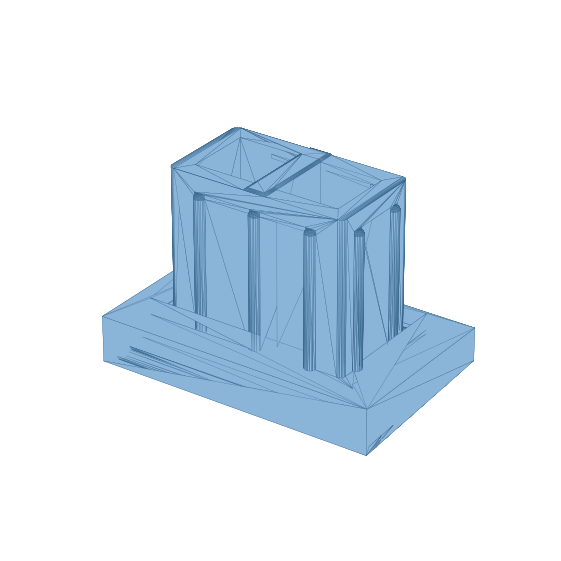 | **Furniture leg** — replacement furniture leg, many iterations | Ножка | v1–v3 + f1/1209 iterations | 51 × 31 × 48 mm |
| 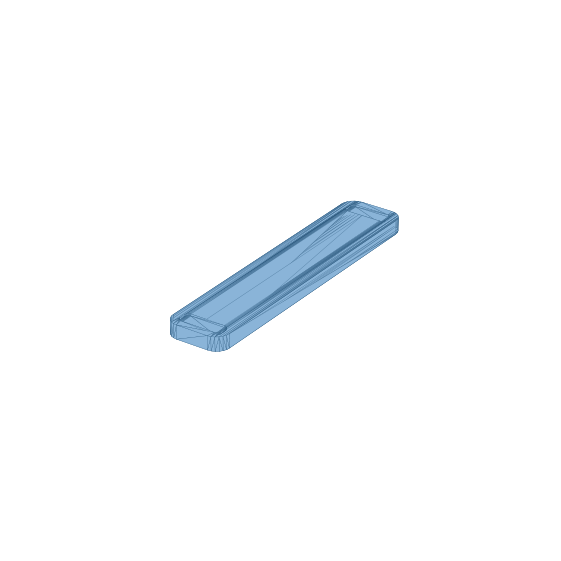 | **Keyboard feet** — replacement tilt feet for a keyboard | Ножки для клавиатуры | v1 | 22 × 107 × 7 mm |
| 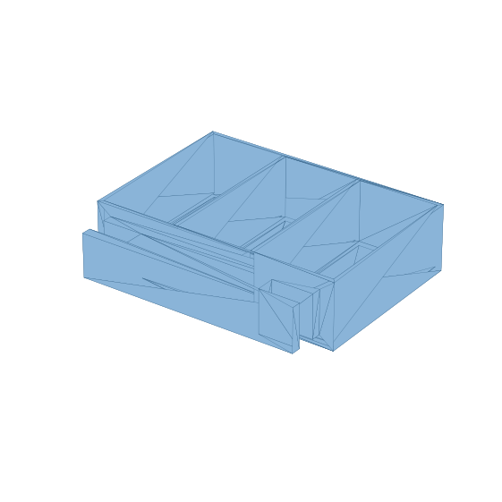 | **Crib shelf** — small organizer shelf for a baby crib, 2- and 3-section variants | Полочка для кроватки | 2 sections; 3 sections v1–v2.1 | — |
| 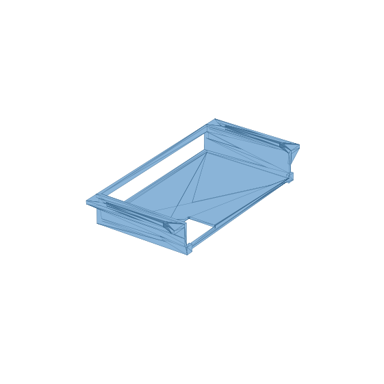 | **KVM desk mount** — under-desk holder for a KVM switch | KVM держатель для стола | v1 | 67 × 136 × 27 mm |

## Repository layout

```
<project>/
  <project>-v1.skp   # SketchUp source
  <project>-v1.stl   # print-ready export
previews/            # rendered previews (auto-generated)
render_previews.py   # script that renders previews/ from the STLs
```

Versions with the same name are design iterations — later versions supersede earlier ones, but all are kept for history.

## PrusaSlicer settings

`prusaslicer/PrusaSlicer_config_bundle.ini` — full config bundle (import via *File → Import → Import Config Bundle*):

- **Printers:** Anycubic Kobra 2 Pro (+ profile tuned for Anycubic Mega S)
- **Filaments:** ROSA 3D PLA, Professional Lab PLA+ Silver, generic PLA, PETG Transparent
- **Print profiles:** per-filament tuned profiles with drying / retraction / temperature notes embedded in `filament_notes`

## Printing notes

- Modeled in SketchUp, exported to STL. No supports needed for most parts.
- G-code is not stored here — slice for your own printer (I use PrusaSlicer).

---

*Maintained as a backup + portfolio. Author: [Ivan Makukhin](https://github.com/makukhin-ie).*
